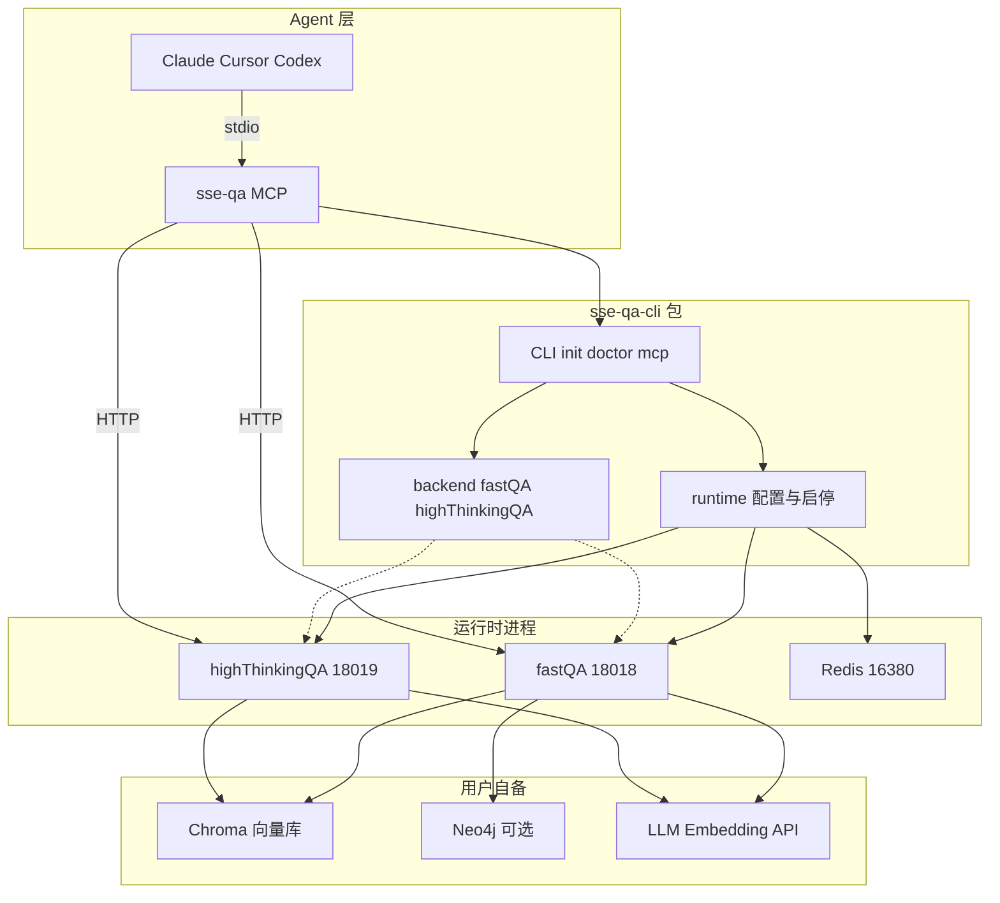
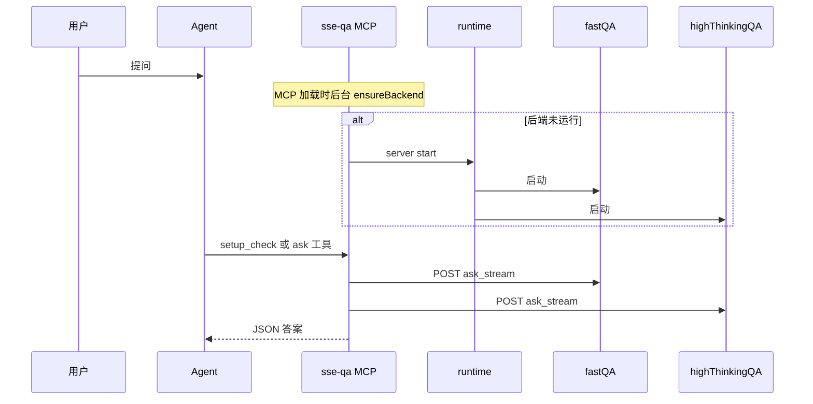
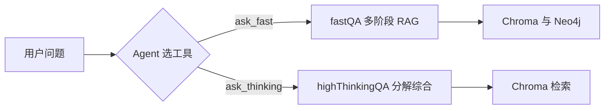

# SSE_QA — 固态电解质 Agent-only 问答系统

面向 **Claude / Codex / Cursor** 等编程 Agent 的**单用户**固态电解质（SSE）/ 全固态电池（ASSB）文献问答后端。

- **领域**：硫化物 / 氧化物 / 聚合物 / 卤化物固态电解质，离子电导率，界面稳定性，合成工艺等
- **接入方式**：npm 包 [`@sse-qa/cli`](https://www.npmjs.com/package/@sse-qa/cli)（CLI + MCP + 后端运行时 + 配置模板）
- **问答能力**：fastQA（文献快答）与 highThinkingQA（深度综合分析）
- **知识来源**：用户自备 **Chroma 向量库** + 可选 **Neo4j 图谱**；服务本身不打包数据

### 发布地址

| 渠道 | 链接 |
|------|------|
| **GitHub** | [github.com/BaBaoZhooou/SSE_QA](https://github.com/BaBaoZhooou/SSE_QA) |
| **npm** | [`@sse-qa/cli`](https://www.npmjs.com/package/@sse-qa/cli)（全局命令 `sse-qa`） |
| **当前版本** | `0.3.4` |

```bash
npm install -g @sse-qa/cli
export PATH="$(npm config get prefix)/bin:$PATH"   # 或 ~/.npm-global/bin
sse-qa --help
```

---

## 目录

0. [一键安装（给 Coding Agent）](#0-一键安装给-coding-agent)
1. [快速上手](#1-快速上手)
2. [系统架构](#2-系统架构)
3. [请求与预热流程](#3-请求与预热流程)
4. [问答与检索策略](#4-问答与检索策略)
5. [Agent 接入与常用命令](#5-agent-接入与常用命令)
6. [配置说明](#6-配置说明)
7. [数据准备（Chroma / Neo4j）](#7-数据准备chroma--neo4j)
8. [源码开发](#8-源码开发)
9. [npm 包与发布](#9-npm-包与发布)
10. [故障排查](#10-故障排查)
11. [目录索引](#11-目录索引)

---

## 0. 一键安装（给 Coding Agent）

新用户可将下面**一句话**粘贴到 **Claude / Codex / Cursor** 的对话中，由 Agent 按「0.2 安装剧本」完成安装、配置与验收。

> **注意**：只粘贴「0.1 一句话」；**切勿**把整篇 README 或安装剧本贴进终端。

### 0.1 复制给 Agent 的一句话（尚未 clone 仓库）

```text
请 clone https://github.com/BaBaoZhooou/SSE_QA 到本机，阅读 README「0.2 Agent 安装剧本」，帮我在本机安装并配置 SSE QA：优先 npm install -g @sse-qa/cli；配置 PATH；sse-qa init；引导我本地填写 ~/.sse-qa/secrets.env 与 config.yaml（LLM Key、Chroma 绝对路径、可选 Neo4j）；运行 scripts/ingest_sse_md_chroma.py 入库（若有结构化 MD）；sse-qa server start 与 sse-qa doctor 直到通过；注册 MCP；最后给日常使用说明。
```

### 0.2 Agent 安装剧本

#### 阶段 A — 环境检查

```bash
node -v          # 需要 >= 20
python3 --version
docker info      # 可选；有 Docker 则优先 compose 启后端
npm config get prefix
```

- 记下 npm global prefix，其下 `bin/` 须在 PATH 中。
- 若 `sse-qa` 不在 PATH，MCP 注册须使用**绝对路径**。

#### 阶段 B — 安装 CLI（推荐 npm）

**已发布 npm（推荐）**：

```bash
npm install -g @sse-qa/cli
# 若提示 allow-scripts，可执行：npm approve-scripts @sse-qa/cli
export PATH="$(npm config get prefix)/bin:$PATH"
# 常见：export PATH="$HOME/.npm-global/bin:$PATH"
sse-qa --help
sse-qa init
```

**从 GitHub 源码本地安装（开发 / 未装 npm 包时）**：

```bash
git clone https://github.com/BaBaoZhooou/SSE_QA ~/sse-qa
cd ~/sse-qa
bash scripts/sync-server-bundle.sh
cd packages/sse-qa-cli
npm install && npm run build && npm link
export PATH="$(npm config get prefix)/bin:$PATH"
sse-qa --help
```

#### 阶段 C — 初始化配置

```bash
sse-qa init
sse-qa config show
```

#### 阶段 D — 向用户收集并写入配置

| 配置项 | 文件 | 键 |
|--------|------|-----|
| LLM API Key | `~/.sse-qa/secrets.env` | `LLM_API_KEY` |
| fastQA 向量库（摘要） | `~/.sse-qa/config.yaml` | `chroma.fastqa.vector_db_path` |
| fastQA MD 向量库 | `~/.sse-qa/config.yaml` | `chroma.fastqa.vector_db_md_path` |
| thinking 向量库 | `~/.sse-qa/config.yaml` | `chroma.thinking.persist_dir` + `collection_name: sse_literature` |
| 是否启用 Neo4j | `~/.sse-qa/config.yaml` | `neo4j.enabled` |
| Neo4j 密码 | `~/.sse-qa/secrets.env` | `NEO4J_PASSWORD`（启用时需要） |

- 勿在对话中明文收集 API Key；让用户本地编辑 `secrets.env`。
- 建议：`chmod 600 ~/.sse-qa/secrets.env`
- 通常只填 `LLM_API_KEY` 即可（见 [§6](#6-配置说明)）。

#### 阶段 E — 校验并启动后端

```bash
sse-qa config validate --json
sse-qa server install
sse-qa server start
sse-qa doctor --json
```

#### 阶段 F — 注册 MCP

```bash
# 推荐：永久写入 ~/.bashrc
export PATH="$(npm config get prefix)/bin:$PATH"

SSE_QA_BIN="$(command -v sse-qa)"   # 若为空，用绝对路径如 ~/.npm-global/bin/sse-qa
claude mcp add sse-qa \
  --env SSE_QA_AUTO_START=1 \
  --env SSE_QA_ENABLED_MODES=fast,thinking \
  -- "$SSE_QA_BIN" mcp --auto-start
claude mcp list
```

Cursor / Codex：见 [`packages/sse-qa-cli/examples/`](packages/sse-qa-cli/examples/)，将 MCP 命令中的 `sse-qa` 换为阶段 F 得到的**绝对路径**。

#### 阶段 G — MCP 验收

调用 MCP 工具 **`setup_check`**（`refresh: true`）；`ready_for_qa: true` 即可问答。

#### 阶段 H — 交付使用说明

1. 简单事实 → `ask_fast`；对比/机理/综述 → `ask_thinking`
2. 维护：`sse-qa doctor`、`sse-qa server status`
3. 配置目录：`~/.sse-qa/`
4. 故障：见 [§10](#10-故障排查)

### 0.3 安装完成 Checklist

- [ ] `sse-qa --help` 可用
- [ ] Chroma 路径为真实绝对路径
- [ ] `LLM_API_KEY` 已配置
- [ ] `sse-qa config validate` 与 `sse-qa doctor` 通过
- [ ] MCP `sse-qa` 已 Connected
- [ ] `setup_check` → `ready_for_qa: true`

---

## 1. 快速上手

### 1.1 前置条件

| 项目 | 要求 |
|------|------|
| Node.js | >= 20 |
| 运行时 | Docker（推荐）或 Python 3.11+ |
| LLM | OpenAI 兼容 API Key（如 DashScope） |
| Chroma | fastQA + thinking 各一份 persist 目录（**绝对路径**） |
| Neo4j | 可选 |
| Redis | Docker compose 内嵌；native 模式需本机 `:16380` |

### 1.2 手动安装

由 Coding Agent 安装请直接用 [§0](#0-一键安装给-coding-agent)。

```bash
npm install -g @sse-qa/cli
export PATH="$(npm config get prefix)/bin:$PATH"

sse-qa init
# 编辑 ~/.sse-qa/config.yaml 与 secrets.env

sse-qa config validate
sse-qa server install
sse-qa server start --mode native   # 入库 Chroma 期间建议 native；稳定后可用 auto/docker
sse-qa doctor
```

### 1.3 注册 MCP

```bash
SSE_QA_BIN="$(command -v sse-qa)"
claude mcp add sse-qa \
  --env SSE_QA_AUTO_START=1 \
  -- "$SSE_QA_BIN" mcp --auto-start
```

npm 安装后也可用：

```bash
npx -y @sse-qa/cli mcp --auto-start
```

MCP 注册仍建议使用 `command -v sse-qa` 或绝对路径，避免 PATH 问题。

---

## 2. 系统架构

### 2.1 组件总览



### 2.2 `@sse-qa/cli` 包内容

| 路径 | 内容 |
|------|------|
| `dist/` | `sse-qa` CLI 与 MCP |
| `runtime/backend/` | fastQA、highThinkingQA Python 服务 |
| `runtime/docker/` | Docker Compose |
| `runtime/templates/` | 配置 Schema |
| `examples/` | Claude / Cursor / Codex MCP 示例 |

### 2.3 包内提供 vs 用户自备

| 包内 | 用户自备 |
|------|----------|
| MCP、CLI、后端代码、配置模板 | Chroma 目录（绝对路径） |
| Redis（compose 内嵌） | LLM API Key |
| 配置渲染 → `~/.sse-qa/runtime/` | Neo4j 实例（可选）、向量 ingest |

### 2.4 MCP 工具

| 工具 | 说明 |
|------|------|
| `setup_check` | 自检并返回 `user_guidance` |
| `health_check` | 后端健康 + 配置摘要 |
| `ask_fast` | fastQA 文献快答 |
| `ask_thinking` | highThinkingQA 深度分析 |

Agent 根据问题类型选择 `ask_fast` 或 `ask_thinking`。

---

## 3. 请求与预热流程



| 环境变量 | 默认 | 说明 |
|----------|------|------|
| `SSE_QA_AUTO_START` | `1` | MCP 加载时自动启动后端 |
| `SSE_QA_START_TIMEOUT_MS` | `120000` | 预热超时 |
| `SSE_QA_ENABLED_MODES` | `fast,thinking` | 启用的 MCP 工具 |
| `SSE_QA_FASTQA_URL` | `http://127.0.0.1:18018` | fastQA 地址 |
| `SSE_QA_THINKING_URL` | `http://127.0.0.1:18019` | thinking 地址 |

**选路**：简单事实 → `ask_fast`；对比、机理、综述 → `ask_thinking`。复杂问题可设 `timeoutSeconds: 360`。

---

## 4. 问答与检索策略

两条问答支线：**fastQA**（快答 RAG）与 **highThinkingQA**（分解 + 检索 + 综合）。共用 LLM API，向量库路径独立。

### 4.1 策略总览



| 能力 | fastQA | highThinkingQA |
|------|--------|----------------|
| 主检索 | Chroma 摘要/MD + PDF chunk | Chroma 文献 chunk |
| 图谱 | Neo4j SSE schema（可选） | — |
| 典型延迟 | 1–3 分钟 | 2–5 分钟 |
| Prompt | `fastQA/prompts/` | `highThinkingQA/prompts/` |

### 4.2 fastQA

**API**：`POST http://127.0.0.1:18018/api/ask_stream`

意图快标 → Stage1 规划 → Stage2 向量检索 → 可选 Neo4j → MD/PDF 证据 → 合成答案。

详见 [`fastQA/docs/03-rag-planner-retriever-llm.md`](fastQA/docs/03-rag-planner-retriever-llm.md)。

### 4.3 highThinkingQA

**API**：`POST http://127.0.0.1:18019/api/ask_stream`

Direct Answer + 问题分解 → 子问题检索（`sse_literature`）→ 综合答案。

### 4.4 Neo4j（可选）

- 导入脚本：仓库 `知识图谱/`
- 配置：`neo4j.url`、`neo4j.schema: sse`；关闭设 `neo4j.enabled: false`
- 不可用时不影响服务，fastQA 降级为纯向量 RAG

---

## 5. Agent 接入与常用命令

| 平台 | 说明 |
|------|------|
| Claude | [§0.2 阶段 F](#0-一键安装给-coding-agent) 或 [§1.3](#13-注册-mcp) |
| Cursor / Codex | [`examples/cursor.mcp.json`](packages/sse-qa-cli/examples/cursor.mcp.json)、[`codex.config.toml`](packages/sse-qa-cli/examples/codex.config.toml) |

```bash
sse-qa init [--force]
sse-qa config show|validate
sse-qa setup-check / doctor
sse-qa server install|start|stop|status
sse-qa health --json
sse-qa ask-fast "问题" --json --timeout 360
sse-qa ask-thinking "问题" --json --timeout 360
sse-qa mcp --auto-start
```

---

## 6. 配置说明

`sse-qa init` 生成 `~/.sse-qa/config.yaml` 与 `secrets.env`。

```yaml
llm:
  base_url: https://dashscope.aliyuncs.com/compatible-mode/v1
  model: qwen3.6-plus
  api_key_file: ~/.sse-qa/secrets.env

embedding:
  type: remote
  base_url: https://dashscope.aliyuncs.com/compatible-mode/v1
  model: text-embedding-v4
  api_key_file: ~/.sse-qa/secrets.env

chroma:
  fastqa:
    vector_db_path: ~/.sse-qa/data/chroma/fastqa_vector    # collection: lfp_papers
    vector_db_md_path: ~/.sse-qa/data/chroma/fastqa_md      # collection: md_papers
  thinking:
    persist_dir: ~/.sse-qa/data/chroma/thinking
    collection_name: sse_literature

neo4j:
  enabled: true
  url: bolt://127.0.0.1:7698
  username: neo4j
  password_file: ~/.sse-qa/secrets.env
  schema: sse

ports:
  fastqa: 18018
  thinking: 18019
  redis: 16380

modes:
  enabled: fast,thinking

rerank:
  provider: none
```

**API Key**：通常只填 `secrets.env` 中的 `LLM_API_KEY`；意图模型与 Embedding 未单独配置时会复用该 Key。

**模型角色**：主 LLM（`llm.model`）、fastQA 意图模型（默认 `qwen3-8b`，与 `llm.base_url` 同网关）、Embedding（`embedding.model`）。

Schema：[`runtime/templates/config.schema.json`](packages/sse-qa-cli/runtime/templates/config.schema.json)

渲染产物（自动生成）：`~/.sse-qa/runtime/system.agent.yaml`、`system.env`、`docker.env`

### 端口

| 组件 | 端口 | 必需 |
|------|------|------|
| fastQA | 18018 | 是 |
| highThinkingQA | 18019 | 是 |
| Redis | 16380 | 是 |
| Neo4j | 7698（示例） | 否 |

---

## 7. 数据准备（Chroma / Neo4j）

npm 包**不含**向量或图谱数据，需在本机 ingest。

### 7.1 Chroma 目录与 collection

| 用途 | 配置键 | Chroma collection |
|------|--------|-------------------|
| fastQA 摘要检索 | `chroma.fastqa.vector_db_path` | `lfp_papers` |
| fastQA MD 扩展 | `chroma.fastqa.vector_db_md_path` | `md_papers` |
| highThinkingQA | `chroma.thinking.persist_dir` | `sse_literature`（见 `collection_name`） |

路径必须为**绝对路径**（可放在 `~/.sse-qa/data/chroma/` 下）。

### 7.2 从结构化 MD 一键入库

仓库提供脚本，将 `*/vlm/*.md` 文献批量写入上述三个库（Embedding：`text-embedding-v4`，2048 维）：

```bash
git clone https://github.com/BaBaoZhooou/SSE_QA ~/sse-qa   # 仅需脚本时
cd ~/sse-qa

# 全量（约 3500 篇，耗时数小时，支持断点续传）
python3 scripts/ingest_sse_md_chroma.py \
  --source /path/to/结构化文献/固态电解质_筛选通过 \
  --out ~/.sse-qa/data/chroma \
  --workers 2

# 试跑 5 篇
python3 scripts/ingest_sse_md_chroma.py --limit 5

tail -f ~/.sse-qa/ingest_sse_md.log   # 若后台 nohup 运行
```

入库完成后更新 `~/.sse-qa/config.yaml` 中 chroma 路径，并：

```bash
sse-qa server config render
sse-qa server stop && sse-qa server start --mode native
sse-qa doctor
```

### 7.3 Neo4j（可选）

```bash
bash scripts/知识图谱/start_neo4j_kg.sh
# 导入见 知识图谱/neo4j/README.md
```

---

## 8. 源码开发

**直接跑 Python 后端**（不经过 npm CLI）：

```bash
cp config/system.agent.yaml.example config/system.agent.yaml
# 编辑配置
bash scripts/start_agent_all.sh
```

**开发 CLI 包**：

```bash
bash scripts/sync-server-bundle.sh
cd packages/sse-qa-cli && npm install && npm run build && npm link
export PATH="$(npm config get prefix)/bin:$PATH"
sse-qa doctor
```

---

## 9. npm 包与发布

| 包 | 命令 | 作用 |
|----|------|------|
| [`@sse-qa/cli`](https://www.npmjs.com/package/@sse-qa/cli) | `sse-qa` | CLI + MCP + 后端启停 + 配置 |

**用户安装**（已发布）：

```bash
npm install -g @sse-qa/cli
```

**维护者**：仓库 [BaBaoZhooou/SSE_QA](https://github.com/BaBaoZhooou/SSE_QA) · 发布流程 [`docs/RELEASE.md`](docs/RELEASE.md) · 账号说明 [`docs/OWN_ACCOUNT_SETUP.md`](docs/OWN_ACCOUNT_SETUP.md)

仓库内开发构建：

```bash
bash scripts/sync-server-bundle.sh && cd packages/sse-qa-cli && npm run build
bash scripts/audit-release-safety.sh   # 发布前审计
```

---

## 10. 故障排查

| 现象 | 处理 |
|------|------|
| `sse-qa: command not found` | 将 npm global 的 `bin` 目录加入 PATH（见 §1.2）；MCP 注册使用 `sse-qa` 绝对路径 |
| npm `allow-scripts` 警告 | `npm approve-scripts @sse-qa/cli` 后重装 |
| MCP Failed to connect | MCP 命令用绝对路径；先 `sse-qa server start` |
| MCP 启动慢 | 首次冷启动 30–120s；可手动 `sse-qa server start` 常驻 |
| `doctor` Chroma 失败 | 检查绝对路径与 `chroma.sqlite3`；collection 名见 §7.1 |
| `Collection [lfp_papers] does not exist` | 未 ingest；运行 `scripts/ingest_sse_md_chroma.py` |
| 检索无结果 | 向量库未 ingest 或 collection 名不匹配 |
| Neo4j 失败 | 检查 Bolt URL/密码；Docker 后端用 `host.docker.internal` |
| Redis 失败（native） | 启动 `:16380` 或改用 Docker compose |

---

## 11. 目录索引

```text
SSE_QA/
├── README.md
├── docs/agent-install.md
├── config/system.agent.yaml.example
├── scripts/
│   ├── sync-server-bundle.sh
│   ├── ingest_sse_md_chroma.py   # MD → Chroma 三库入库
│   └── audit-release-safety.sh
├── fastQA/
├── highThinkingQA/
├── 知识图谱/
└── packages/sse-qa-cli/          # @sse-qa/cli
    ├── dist/
    ├── runtime/backend/
    ├── runtime/docker/
    └── examples/
```
